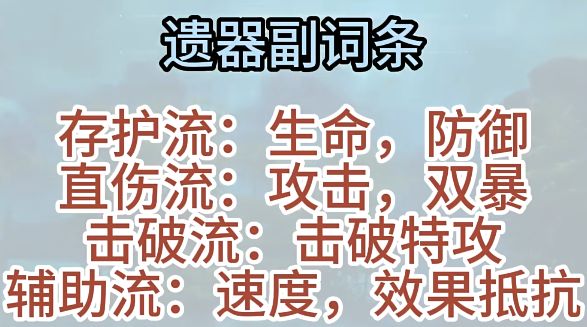

参考视频

[70级还不会养艾丝妲？艾丝妲最新基础攻略，玩法解析，授人以渔，进来学习](https://www.bilibili.com/video/BV1x94y177Dw/?spm_id_from=333.337.search-card.all.click&vd_source=86646d951d84826a4640314db345f2aa)

大招加速两回合，天赋为全队增加攻击力。

保证大招和天赋的覆盖率，选择速度鞋和充能绳。

辅助能力不受艾丝妲自身面板数值影响

## 光锥

但战斗还未结束（5🌟）

记忆中的模样（4🌟）

轮契（3🌟）

以上都是想要实现两动一大，但是需要频繁使用战技。

大月卡光锥——镂月裁云之意，全队增益

舞舞舞——拉条（但是弹幕说和加速稀释）

与行星相会——与火C搭配

不推荐过往未来

## 遗器

### 二件套

宇宙三 仙舟套

宇宙七 龙骨套

想要两动一大就刷：

宇宙四 生命的翁瓦克——自身拉条，适合追加攻击队/dot队

宇宙八 梦想的皮诺康尼——辅助火C

击破流：

宇宙四——盗贼公国塔利亚

**宇宙四和宇宙八通用性较差。**

生存压力大带生命球，否则火球

能量绳，前期可以带击破特攻过渡，后期需要换回充能绳

### 四件套

前期可以使用怪盗套——击破流

也可以带戍卫风雪的铁卫套、净庭宗教的圣骑士（防御套）、莳者套、信使套散件套装就行

后期刷信使4——纯辅助流

生存压力大生命衣，否则暴击衣或攻击衣

速度鞋

### 副词条

