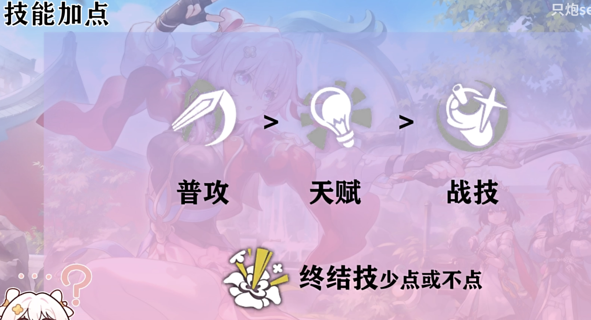
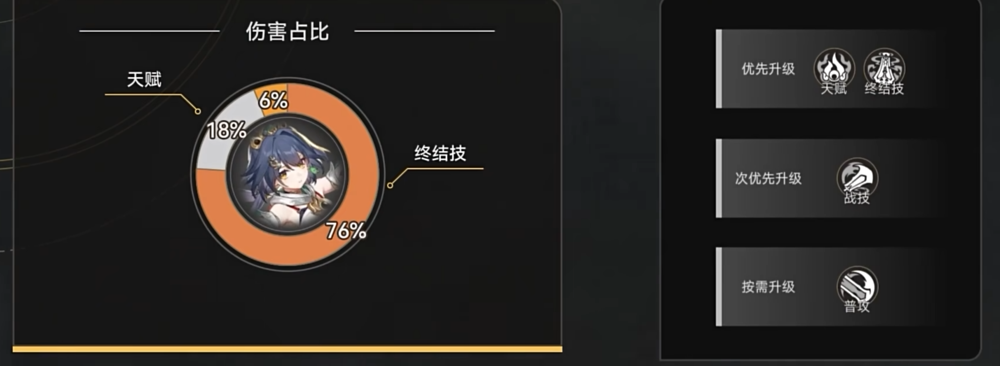

# 云璃

对于崩铁没有找到我喜欢的比较固定且优质做攻略的博主，以前都是看卡特亚，所以做一个条目还是要参考较多的视频，尽可能做到全面。

参考视频链接：https://www.bilibili.com/video/BV1A2vZenEa9

这个视频讲挺好的，是一个随便找的日期是比较靠后的。

https://www.bilibili.com/video/BV1Sw4m1k7q2

卡特亚的，拿的创作体验服讲的。很多东西还是没讲到，比如技能加点、反击攻击类型。

https://www.bilibili.com/video/BV1mf421q72d

梦轩dada的，动效做得很好，观感不错，比较详细。

## 机制与技巧

未开启大招时，受击时释放普通反击，否则释放强化反击。

开启大招后，轮到自身回合时，不受击则释放普通强化反击。

对大招依赖强，需要充能队友和自身高嘲讽值。

弹反对象和时机的选择：在满拐的情况下，在中间敌人攻击前释放。用小反击干掉两边的小怪。

在敌人释放控制技能前开大，拉到自己身上。

行动条下一个角色结束后，敌人开始前释放大招，比如下一个是藿藿，此时藿藿还未行动，处于技能选择界面，云璃开大，藿藿释放技能，敌人攻击云璃后，进行完美弹反。

对于dot类型攻击无法反击。

## 遗器

外圈更推荐勇烈套，大公也能用，但我有多的莳者，词条都不错的，就懒得再刷了。加生命的，都不一定再连个玲可了。

内圈奔狼没有太亮眼的表现，更推荐停转。

暴击率衣+攻击鞋，暴击率尽量堆到90%，爆伤130%

物理球+攻击绳

如果有加攻击的辅助，可以带充能绳。不带鸟还是选择攻击绳。

## 队伍选择

拐攻击的：停云、知更鸟（如果不想带停云，可以上阮梅、花火或者巡猎三月七，不推荐不带知更鸟）

我没有知更鸟，伤害会少挺多。

生存位只推荐藿藿和符玄，更推荐符玄（这老米越来越精了，适合一队的全放一期池子里了）。如果是没有专武，只能用玲可，加的嘲讽值和专武一致。

不推荐砂金

也不一定要生存位，直接三拐一，上停云、鸟、花火。

站位：放中间，两边放充能需求大的队友。

## 光锥

五星如下：

四星只推荐“在蓝天下”

## 天赋加点

